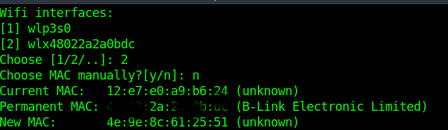
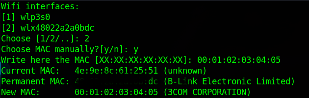

**Disclaimer** : This software is meant for educational purposes only. I'm not responsible for any malicious use of the app.
# MAChange by stosempreingiro

This is a very simple python script that change your MAC address on debian based distro.


## Features of MAChange 
* change MAC address automatically
* change MAC address manually


## Prerequisites
This MAC changer requires macchanger and net-tools to work. Install them automatically with 'install.sh' file

## Installation
```
git clone https://github.com/stosempreingiro/MAChange.git
cd MAChanger
cd wlan\ type 
'or'
cd wlp3\ type
chmod +x install.sh && ./install.sh
```
# How to use
If iwconfig gives you back wireless interface like "wlan0" choose the directory "wlan type".\
If iwconfig gives you back wireless interface like "wlp3s0" choose the directory "wlp3s type".\
Install all you need with './install.sh'\
Run 'sudo mac' on your terminal.\
ENJOY

## Examples
* change MAC address automatically
<p align="center">
  
</p>
-----------------------------------------------------------------------------------------------------------------------

* change MAC address manually 
<p align="center">
  
</p>
-----------------------------------------------------------------------------------------------------------------------

